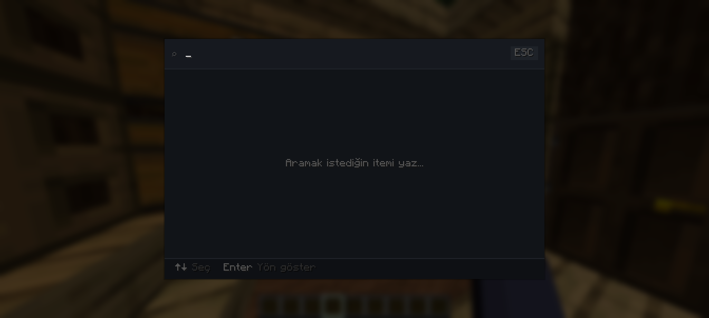
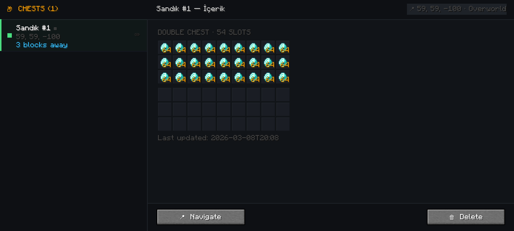
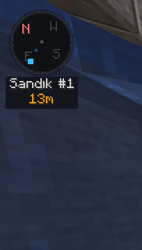

# 📦 ChestMemory

> **Never forget where you stored it.**

ChestMemory automatically indexes every chest you open, so you can instantly search for any item and navigate directly to it — no more opening every chest to find what you need.

---

## ✨ Features

- **Auto Indexing** — Every chest you open is silently recorded. No setup required.
- **Instant Search** — Press `F` to open the search overlay. Type an item name and see every chest it's stored in, with distance and direction.
- **Chest Records** — Press `G` to browse all indexed chests with a full slot-by-slot preview.
- **Navigation** — Select any chest from search or records to activate a HUD compass pointing directly to it.
- **Custom Names** — Rename any chest (e.g. "Weapons", "Food Storage") for easier identification.
- **Per-World Storage** — Each world has its own separate index. Nothing gets mixed up.
- **Dimension Aware** — Only shows chests from your current dimension. Others are clearly marked.

---

## 🖼️ Screenshots

### Search Overlay

### Chest Records

### HUD Compass

---

## ⌨️ Keybinds

| Key | Action |
|-----|--------|
| `F` | Open search overlay |
| `G` | Open chest records screen |

> Both keybinds can be changed in Minecraft's Controls settings.

---

## ⚙️ Configuration

Config file is located at: `.minecraft/config/chestmemory/config.json`

| Option | Default | Description |
|--------|---------|-------------|
| `toastEnabled` | `true` | Show toast when a chest is indexed |
| `toastPosition` | `BOTTOM_RIGHT` | Toast position on screen |
| `compassPosition` | `TOP_LEFT` | Navigation compass position |

---

## 📋 How It Works

1. **Open any chest** — ChestMemory silently records its contents and location.
2. **Press `F`** — Type what you're looking for. Results appear instantly with distance and direction.
3. **Press Enter or click** — A compass appears on your HUD guiding you to the chest.
4. **Press `G`** — Browse all your indexed chests and preview their contents slot by slot.

---

## 🔧 Requirements

- Minecraft 1.21.11
- Fabric Loader
- Fabric API

---

## 📥 Installation

1. Install [Fabric Loader](https://fabricmc.net/use/)
2. Download [Fabric API](https://modrinth.com/mod/fabric-api)
3. Download ChestMemory from [Modrinth](#) or [CurseForge](#)
4. Place both `.jar` files in your `.minecraft/mods` folder
5. Launch Minecraft with the Fabric profile
0
---

## 📄 License

MIT License — see [LICENSE](LICENSE) for details.

---

## 🙏 Credits

Made by [Muhofy](https://github.com/Muhofy)