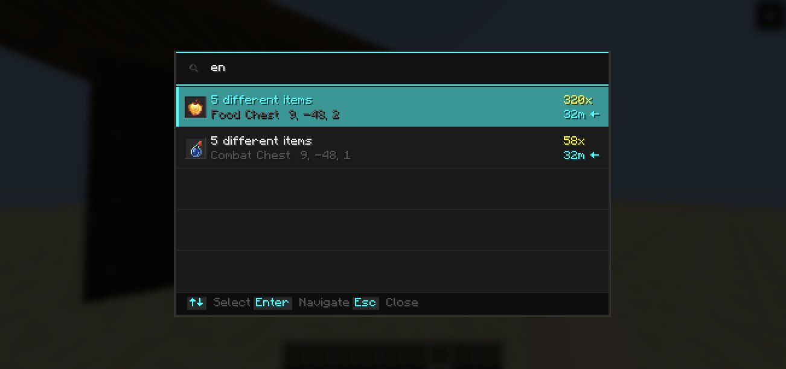
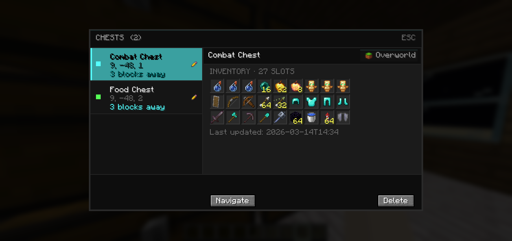

# 📦 ChestMemory

> **Never forget where you stored it.**

ChestMemory automatically indexes every chest you open and lets you instantly search for any item across all your chests — with distance, direction, and a full slot preview.

---

## 🔍 How It Works

Open a chest → it gets silently recorded. That's it. No setup, no commands, no manual tagging.

When you need something, press **F**, type the item name, and ChestMemory tells you exactly which chest has it and how far away it is. Press Enter and a compass guides you straight there.

---

## ✨ Features

- 🔍 **Instant Search** — Press `F`, type any item name, get results immediately
- 📦 **Auto Indexing** — Every chest you open is recorded silently in the background
- 🗂️ **Chest Records** — Press `G` to browse all indexed chests with full slot-by-slot preview
- 🧭 **Navigation** — HUD compass guides you directly to the selected chest
- ✏️ **Custom Names** — Rename chests like "Weapons" or "Food Storage" for easy identification
- 🌍 **Dimension Aware** — Overworld, Nether and End chests are tracked separately
- 💾 **Per-World Storage** — Each world has its own index, nothing gets mixed up
- ⚡ **Lightweight** — Client-side only, no server required

---

## 🖼️ Screenshots

---

## ⌨️ Keybinds

| Key | Action |
|-----|--------|
| `F` | Open search overlay |
| `G` | Open chest records |

> Keybinds can be changed in Minecraft's Controls settings.

---

## 🔧 Requirements

- Minecraft **1.21.11**
- Fabric Loader
- Fabric API

---

## ❓ FAQ

**Does this work on servers?**
Yes — ChestMemory is client-side only. It works on any server without any server-side installation.

**Does it support Barrels or Shulker Boxes?**
Not in v1.0. Barrel, Shulker Box and Ender Chest support is planned for a future update.

**Will it affect performance?**
No. Indexing happens only when you open a chest, and search runs entirely on cached local data.

---

## 📄 License

MIT — [GitHub](https://github.com/muhofy/chestmemory)